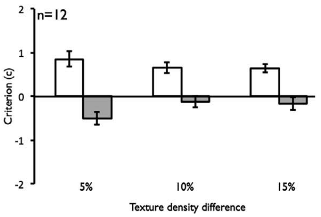
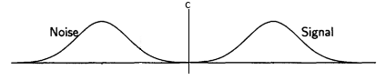

```{r global_options, include=FALSE}
knitr::opts_chunk$set(echo=FALSE)
```

```{r setup, include=FALSE}
options(htmltools.dir.version = FALSE)
```

```{r}
# Packages
if (!require('pacman', quietly = TRUE)) install.packages('pacman'); library('pacman', quietly = TRUE)
p_load(knitr)
```

## An extremely short into to Signal detection theory (SDT)

--

- SDT provides separate measures of sensitivity and bias (Green & Swets, 1966).

--

- _d'_ is a measure of sensitivity or discriminability

--

- criterion (_c_) is a measure of bias

--

<br/><br/>
<br/><br/>
<br/><br/>

```{r, fig.align='center', out.width = "50%", fig.cap='Wickens, T. D. (2002). Elementary Signal Detection Theory.'}

```

---
class: center, middle

## Stream/bounce effect

<video width="60%" height="60%">
<source src="media/Motion-illusion-2v-YouTube.mp4" type="video/mp4">
</video>

.footnote[[*] https://www.youtube.com/watch?v=ISGnGVfxhBE&list=PLLVKZM6-j144hV3LMDOcf046c9BHJzJyo&index=2]

---

## Stream/bounce effect: perceptual or decisional process

--

Grove et al. compared no-sound vs. with-sound conditions.

.footnote[[*] Grove, P. M., Ashton, J., Kawachi, Y., & Sakurai, K. (2012). Auditory transients do not affect visual sensitivity in discriminating between objective streaming and bouncing events. Journal of Vision, 12(8), 5–5. https://doi.org/10.1167/12.8.5]

--

.pull-left[

]

--

.pull-right[

]

---

## Back to Signal detection theory (SDT)

--

#### SDT provides separate measures of sensitivity and bias (Green & Swets, 1966).

--

.pull-left[
Sensitivity can be:
 - Perceptual sensitivity
 - Memory sensitivity
 - etc.

]

--

.pull-right[
Bias can be:
  - Perceptual bias
  - Memory bias
  - Response bias
  - etc.
]

---

## Criterion effect: what does it mean?

--

.left-column[

]

--

.right-column[
 What is it?

+ perceptual?
{{content}}

]

--

+ decisional?
{{content}}

--

+ magic?
{{content}}

--

By using only _d'_ and _criterion_ you can't tell :(

---

## Response bias misconception 

<!-- Do I have to define styles only in one place? -->

<style>

.middle_center1 {
  margin: 0;
  position: absolute;
  top: 50%;
  left: 50%;
  -ms-transform: translate(-50%, -20%);
  transform: translate(-50%, -50%);
  font-size: 120%;
}

</style>

--

.middle_center1[
“A standard approach to independently characterize perceptual and decisional processes in perception is signal detection theory (SDT)” (Grove et al., 2012, page 2)
]

---

## Response bias misconception 
<!-- The misconception that d' reflects necessarily perceptual effects and that criterion necessarily reflects decision processes is fairly widespread. -->

<style>

.middle_center2 {
  margin: 0;
  position: absolute;
  top: 50%;
  left: 40%;
  -ms-transform: translate(-50%, -20%);
  transform: translate(-50%, -50%);
  font-size: 150%;
  
}

</style>

--

.middle_center2[

_d'_&nbsp;&nbsp;&nbsp;&nbsp;&nbsp;&nbsp;&nbsp;&nbsp;&nbsp;&nbsp;&nbsp;&nbsp;&nbsp;----> (necessarily) perceptual effects  
_criterion_ ----> (necessarily) decision processes

]


---

## Simulatated data example
### Müller-Lyer illusion: Widely thought to be perceptual  


```{r, fig.align='center', out.width = "50%"}

```

.footnote[[*] https://www.illusionsindex.org/ir/mueller-lyer]

---

## Simulatated data example
### Müller-Lyer illusion: Widely thought to be perceptual  

```{r, fig.align='center', out.width = "50%"}

```

.footnote[[*] https://www.illusionsindex.org/ir/mueller-lyer]

---

## Simulatated data example
### Task

.pull-left[
```{r, fig.align='center', out.width = "60%"}

```
]

.pull-right[
<br/><br/>
<br/><br/>
Indicate if a line is a long line or a short line compared to a reference.
]

---

## Simulatated data example
### Results

```{r, fig.align='center', out.width = "55%", fig.cap='Simulated data'}
include_graphics('media/sim-dat-results_blank.png')
```

<!-- --- -->

<!-- ## Simulatated data example -->
<!-- ### Results -->

<!-- .pull-left[ -->
<!-- ```{r, fig.align='center', out.width = "90%"} -->
<!-- include_graphics('media/sim-dat-results_blank.png') -->
<!-- ``` -->
<!-- ] -->

<!-- .pull-right[ -->
<!-- [show my data] -->
<!-- ] -->

---

## Let's plot the criterion other way

<br/><br/>
<br/><br/>

```{r, fig.align='center', out.width = "70%"}

```

<!-- .footnote[[*] Wickens, T. D. (2002). Elementary Signal Detection Theory.] -->

---

## Let's plot the criterion other way

<br/><br/>
<br/><br/>

```{r, fig.align='center', out.width = "70%"}

```

---

## Let's plot the criterion other way

<br/><br/>
<br/><br/>

```{r, fig.align='center', out.width = "70%"}

```

---

## Let's plot the criterion other way

<br/><br/>
<br/><br/>

```{r, fig.align='center', out.width = "70%"}

```

---

## Let's plot the criterion other way

<br/><br/>
<br/><br/>

```{r, fig.align='center', out.width = "70%"}

```

---

## Let's plot the criterion other way

<br/><br/>
<br/><br/>

```{r, fig.align='center', out.width = "70%"}

```

---

## Let's plot the criterion other way

<br/><br/>

```{r, fig.align='center', out.width = "70%", fig.cap='The criterion is a relative measure'}

```


---
.pull-left[

## A criterion shift alone won't tell

```{r, fig.align='center', out.width = "80%"}

```

]

--

.pull-right[ 

```{r, fig.align='center', out.width = "50%"}

```
{{content}}

]

--

```{r, fig.align='center', out.width = "50%"}

```
{{content}}

---

class: center

.left-column[

### Wheter the criterion moves

]

```{r, fig.align='center', out.width = "50%"}

```

---

class: center

.left-column[

### Wheter the criterion moves

### or both distributions move

]

```{r, fig.align='center', out.width = "50%"}

```

---

class: center

.left-column[

### Wheter the criterion moves

### or both distributions move

### you will get a criterion effect.

]

```{r, fig.align='center', out.width = "50%"}

```


---

## When does SDT separates perceptual from decisional processes?

.pull-left[
- If the manipulation __shifts only one distribution__, then a perceptual bias should reveal itself in d′, and c will reflect decisional processes alone__*__. 
]

--

.pull-right[

```{r, fig.align='center', out.width = "60%"}

```

]

---

## When does SDT separates perceptual from decisional processes?

.pull-left[
- If the manipulation __shifts only one distribution__, then a perceptual bias should reveal itself in d′, and c will reflect decisional processes alone__*__. 
]

.pull-right[

```{r, fig.align='center', out.width = "60%"}

```

]

???

Still not sure if this means hat any detection paradigm or a detection paradigm + an specific manipulation that affects only present trials is needed
A smaller FA rate, will shift your noise distribution to the left.
A bigger HIT rate will shift the signal distribution to the right.

But if your hit-rate increases, then you know the criterion shifted because of the d' shift. If d' increases but the criterion moves with it, so centered crit is the same, then you are sure is a sensitivity change.

---

<style>

.pull-left1 {
  float: left;
  position: absolute;
  width: 47%;
  top: 10%;
}

.pull-right1 {
  position: absolute;
  float: right;
  width: 47%;
  top: 5%;
  left: 55%;
}

</style>

.pull-left1[

## One-distribution shift: McDonald et al. (2000) <sup>1</sup>

]

.footnote[
[1] McDonald, J. J., Teder-Sälejärvi, W. A., & Hillyard, S. A. (2000). Involuntary orienting to sound improves visual perception. Nature, 407(6806), 906–908. https://doi.org/10.1038/35038085
]

--

.pull-left1[
<br/><br/>
<br/><br/>
<br/><br/>
<br/><br/>
```{r, fig.align='center', out.width = "60%"}

```
]

--

.pull-right1[
```{r, fig.align='center', out.width = "70%"}

```
]

???

"This kind of experiment has the advantage that changes in c can be interpreted in
terms of decisional processes because only a change in the internal criterion will influence c."


They don't report it, but I'm assuming that there was no effect of the cuing in the absent trials?
Then it would be a hit-rate shift, which is the position of the signal distribution (?)

---

.left-column[
## McDonald et al. (2000) <sup>1</sup> results
]
.right-column[
```{r, fig.align='center', out.width = "60%"}

```
]

.footnote[
[1] McDonald, J. J., Teder-Sälejärvi, W. A., & Hillyard, S. A. (2000). Involuntary orienting to sound improves visual perception. Nature, 407(6806), 906–908. https://doi.org/10.1038/35038085
]

---

.left-column[
## McDonald et al. (2000) <sup>1</sup> results
]
.right-column[
```{r, fig.align='center', out.width = "60%"}

```
]

.footnote[
[1] McDonald, J. J., Teder-Sälejärvi, W. A., & Hillyard, S. A. (2000). Involuntary orienting to sound improves visual perception. Nature, 407(6806), 906–908. https://doi.org/10.1038/35038085
]

---

.left-column[
## McDonald et al. (2000) <sup>1</sup> results
]
.right-column[
```{r, fig.align='center', out.width = "60%"}

```
]

.footnote[
[1] McDonald, J. J., Teder-Sälejärvi, W. A., & Hillyard, S. A. (2000). Involuntary orienting to sound improves visual perception. Nature, 407(6806), 906–908. https://doi.org/10.1038/35038085
]

???

They don't report FA rate. Because the manipulation does not make you better at absent trials?

---

## Another option is DDMs*


```{r, fig.align='center', out.width = "70%"}

```

.footnote[
[*] White, C. N., & Poldrack, R. A. (2014). Decomposing bias in different types of simple decisions. Journal of Experimental Psychology: Learning, Memory, and Cognition, 40(2), 385–398. https://doi.org/10.1037/a0034851
]

---

## Another option is DDMs*


```{r, fig.align='center', out.width = "70%"}

```

.footnote[
[*] White, C. N., & Poldrack, R. A. (2014). Decomposing bias in different types of simple decisions. Journal of Experimental Psychology: Learning, Memory, and Cognition, 40(2), 385–398. https://doi.org/10.1037/a0034851
]

---

## Another option is DDMs*


```{r, fig.align='center', out.width = "70%"}

```

.footnote[
[*] White, C. N., & Poldrack, R. A. (2014). Decomposing bias in different types of simple decisions. Journal of Experimental Psychology: Learning, Memory, and Cognition, 40(2), 385–398. https://doi.org/10.1037/a0034851
]


.pull-left[
```{r, fig.align='center', out.width = "100%"}

```
]

---

## Another option is DDMs*


```{r, fig.align='center', out.width = "70%"}

```

.footnote[
[*] White, C. N., & Poldrack, R. A. (2014). Decomposing bias in different types of simple decisions. Journal of Experimental Psychology: Learning, Memory, and Cognition, 40(2), 385–398. https://doi.org/10.1037/a0034851
]

.pull-left[
```{r, fig.align='center', out.width = "100%"}

```
]

--

.pull-right[
```{r, fig.align='center', out.width = "100%"}

```
]

---

## Another option is DDMs*


```{r, fig.align='center', out.width = "70%"}

```

.footnote[
[*] White, C. N., & Poldrack, R. A. (2014). Decomposing bias in different types of simple decisions. Journal of Experimental Psychology: Learning, Memory, and Cognition, 40(2), 385–398. https://doi.org/10.1037/a0034851
]

.pull-left[
```{r, fig.align='center', out.width = "100%"}

```
]

.pull-right[
```{r, fig.align='center', out.width = "100%"}

```
]

---
class: inverse, center, middle

## Questions?

---

## McDonald et al. (2000) <sup>1</sup> results

```{r, fig.align='center', out.width = "70%"}

```

.footnote[
[1] McDonald, J. J., Teder-Sälejärvi, W. A., & Hillyard, S. A. (2000). Involuntary orienting to sound improves visual perception. Nature, 407(6806), 906–908. https://doi.org/10.1038/35038085
]
